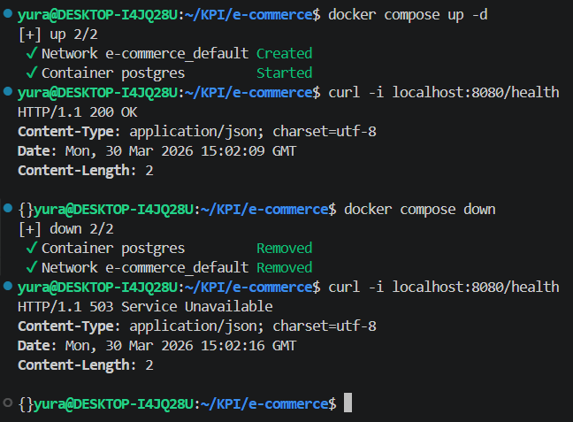
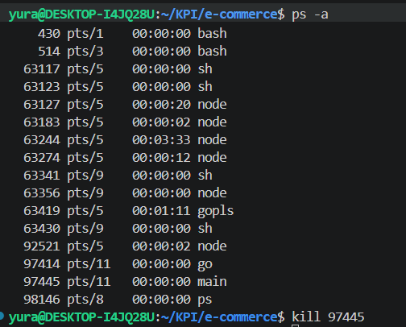
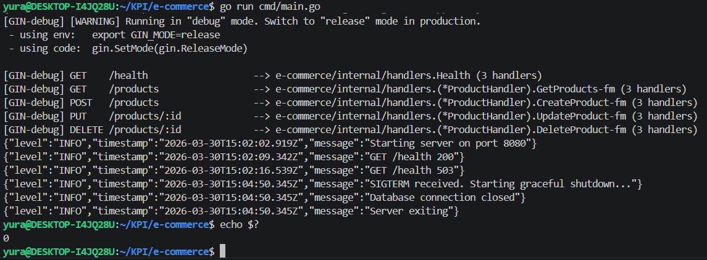

# Проект для предмету "Cучасні технології розгортання e-commerce застосунків"

## Lab 0
### Setup
Go version 1.26.1

ENV variables
```
PORT
DB_HOST
DB_PORT
DB_NAME
DB_USER
DB_PASSWORD
```
Для запуску застосунку
`docker compose up -d`
`go run cmd/main.go`

Для запуску тестів
`go test ./...`

### Healthcheck


### Logs
```
yura@DESKTOP-I4JQ28U:~/KPI/e-commerce$ go run cmd/main.go 
{"level":"INFO","timestamp":"2026-03-30T15:02:02.918Z","message":"migrations applied"}
[GIN-debug] [WARNING] Running in "debug" mode. Switch to "release" mode in production.
 - using env:   export GIN_MODE=release
 - using code:  gin.SetMode(gin.ReleaseMode)

[GIN-debug] GET    /health                   --> e-commerce/internal/handlers.Health (3 handlers)
[GIN-debug] GET    /products                 --> e-commerce/internal/handlers.(*ProductHandler).GetProducts-fm (3 handlers)
[GIN-debug] POST   /products                 --> e-commerce/internal/handlers.(*ProductHandler).CreateProduct-fm (3 handlers)
[GIN-debug] PUT    /products/:id             --> e-commerce/internal/handlers.(*ProductHandler).UpdateProduct-fm (3 handlers)
[GIN-debug] DELETE /products/:id             --> e-commerce/internal/handlers.(*ProductHandler).DeleteProduct-fm (3 handlers)
{"level":"INFO","timestamp":"2026-03-30T15:02:02.919Z","message":"Starting server on port 8080"}
{"level":"INFO","timestamp":"2026-03-30T15:02:09.342Z","message":"GET /health 200"}
{"level":"INFO","timestamp":"2026-03-30T15:02:16.539Z","message":"GET /health 503"}
```

### Gracefull shutdown

